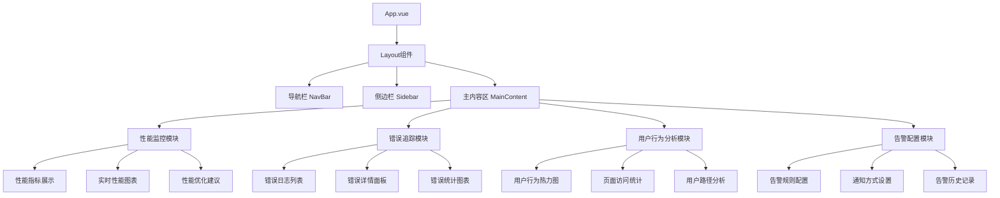

# 前端告警系统设计文档

## 1. 概述

### 1.1 项目背景
前端告警系统是一个用于内部培训的教学平台，旨在展示现代前端应用中的监控、错误追踪和用户行为分析技术。通过实际的代码示例和交互式演示，帮助团队成员理解前端告警的重要性和实现方法。

### 1.2 系统目标
- 演示应用性能监控的核心指标和实现方法
- 展示错误追踪的最佳实践
- 提供用户行为分析的实际案例
- 构建可复用的告警组件库
- 创建完整的教学演示环境

### 1.3 核心价值
- **教育价值**: 通过实际项目展示前端告警的重要性
- **实用价值**: 提供可在生产环境中使用的告警组件
- **参考价值**: 作为团队内部最佳实践的参考标准

## 2. 技术栈与依赖

### 2.1 核心技术栈
- **Vue 3**: 使用Composition API构建响应式用户界面
- **TypeScript**: 提供类型安全和更好的开发体验
- **Vite**: 快速的构建工具和开发服务器
- **Vue Router**: 路由管理
- **Pinia**: 状态管理

### 2.2 监控相关依赖
```typescript
// 性能监控
import { PerformanceObserver } from 'web-vitals';

// 错误监控
interface ErrorInfo {
  message: string;
  stack: string;
  filename: string;
  lineno: number;
  colno: number;
}

// 用户行为追踪
interface UserAction {
  type: string;
  target: string;
  timestamp: number;
  metadata?: Record<string, any>;
}
```

### 2.3 UI组件库
- **Element Plus**: 基础UI组件
- **ECharts**: 数据可视化图表
- **Monaco Editor**: 代码编辑器（用于演示）

## 3. 组件架构

### 3.1 核心组件层次结构



### 3.2 组件定义

#### 3.2.1 性能监控组件
```typescript
// components/PerformanceMonitor.vue
interface PerformanceMetrics {
  fcp: number;          // First Contentful Paint
  lcp: number;          // Largest Contentful Paint
  fid: number;          // First Input Delay
  cls: number;          // Cumulative Layout Shift
  ttfb: number;         // Time to First Byte
}

interface PerformanceMonitorProps {
  autoStart?: boolean;
  interval?: number;
  thresholds?: Partial<PerformanceMetrics>;
}
```

#### 3.2.2 错误追踪组件
```typescript
// components/ErrorTracker.vue
interface ErrorEvent {
  id: string;
  type: 'javascript' | 'promise' | 'resource' | 'network';
  message: string;
  stack?: string;
  timestamp: number;
  url: string;
  userAgent: string;
  userId?: string;
}

interface ErrorTrackerProps {
  enableJSError?: boolean;
  enablePromiseError?: boolean;
  enableResourceError?: boolean;
  maxErrors?: number;
}
```

#### 3.2.3 用户行为分析组件
```typescript
// components/UserBehaviorAnalyzer.vue
interface UserEvent {
  id: string;
  type: 'click' | 'scroll' | 'input' | 'navigation';
  element: string;
  timestamp: number;
  coordinates?: { x: number; y: number };
  value?: string;
  page: string;
}

interface BehaviorAnalyzerProps {
  trackClicks?: boolean;
  trackScrolls?: boolean;
  trackInputs?: boolean;
  heatmapEnabled?: boolean;
}
```

### 3.3 Props/State管理

#### 3.3.1 全局状态管理（Pinia）
```typescript
// stores/alertSystem.ts
interface AlertSystemState {
  performanceData: PerformanceMetrics[];
  errorLogs: ErrorEvent[];
  userBehaviorData: UserEvent[];
  alertRules: AlertRule[];
  notifications: Notification[];
  isMonitoring: boolean;
}

interface AlertRule {
  id: string;
  name: string;
  type: 'performance' | 'error' | 'behavior';
  condition: string;
  threshold: number;
  enabled: boolean;
}
```

#### 3.3.2 组件间通信
```typescript
// 使用Composition API进行组件间通信
import { provide, inject, ref, reactive } from 'vue';

// 父组件提供数据
const alertData = reactive({
  performance: [],
  errors: [],
  behaviors: []
});
provide('alertData', alertData);

// 子组件注入数据
const alertData = inject('alertData');
```

### 3.4 生命周期钩子使用

```typescript
// 在组件中使用生命周期钩子
import { onMounted, onUnmounted, watch } from 'vue';

export default {
  setup() {
    const performanceObserver = ref<PerformanceObserver | null>(null);
    
    onMounted(() => {
      // 初始化性能监控
      initPerformanceMonitoring();
      // 初始化错误监听
      initErrorTracking();
      // 初始化用户行为追踪
      initBehaviorTracking();
    });
    
    onUnmounted(() => {
      // 清理监听器
      cleanup();
    });
    
    watch(() => store.isMonitoring, (newVal) => {
      if (newVal) {
        startMonitoring();
      } else {
        stopMonitoring();
      }
    });
  }
};
```

## 4. 路由与导航

### 4.1 路由结构
```typescript
// router/index.ts
const routes = [
  {
    path: '/',
    name: 'Dashboard',
    component: () => import('@/views/Dashboard.vue'),
    meta: { title: '控制台总览' }
  },
  {
    path: '/performance',
    name: 'Performance',
    component: () => import('@/views/PerformanceView.vue'),
    meta: { title: '性能监控' },
    children: [
      {
        path: 'metrics',
        component: () => import('@/components/PerformanceMetrics.vue')
      },
      {
        path: 'charts',
        component: () => import('@/components/PerformanceCharts.vue')
      },
      {
        path: 'demo',
        component: () => import('@/components/PerformanceDemo.vue')
      }
    ]
  },
  {
    path: '/errors',
    name: 'ErrorTracking',
    component: () => import('@/views/ErrorTrackingView.vue'),
    meta: { title: '错误追踪' },
    children: [
      {
        path: 'logs',
        component: () => import('@/components/ErrorLogs.vue')
      },
      {
        path: 'analysis',
        component: () => import('@/components/ErrorAnalysis.vue')
      },
      {
        path: 'demo',
        component: () => import('@/components/ErrorDemo.vue')
      }
    ]
  },
  {
    path: '/behavior',
    name: 'UserBehavior',
    component: () => import('@/views/UserBehaviorView.vue'),
    meta: { title: '用户行为分析' },
    children: [
      {
        path: 'heatmap',
        component: () => import('@/components/BehaviorHeatmap.vue')
      },
      {
        path: 'analytics',
        component: () => import('@/components/BehaviorAnalytics.vue')
      },
      {
        path: 'demo',
        component: () => import('@/components/BehaviorDemo.vue')
      }
    ]
  },
  {
    path: '/settings',
    name: 'Settings',
    component: () => import('@/views/SettingsView.vue'),
    meta: { title: '告警配置' }
  }
];
```

### 4.2 导航守卫
```typescript
// 路由守卫用于页面追踪
router.beforeEach((to, from, next) => {
  // 记录页面访问
  const behaviorStore = useBehaviorStore();
  behaviorStore.trackNavigation({
    from: from.path,
    to: to.path,
    timestamp: Date.now()
  });
  
  next();
});
```

## 5. 样式策略

### 5.1 CSS架构
采用CSS Modules + SCSS的方式组织样式：

```scss
// styles/variables.scss
$primary-color: #409eff;
$success-color: #67c23a;
$warning-color: #e6a23c;
$danger-color: #f56c6c;

$font-size-small: 12px;
$font-size-base: 14px;
$font-size-large: 16px;

// styles/mixins.scss
@mixin alert-card {
  border-radius: 4px;
  padding: 16px;
  margin-bottom: 16px;
  box-shadow: 0 2px 4px rgba(0, 0, 0, 0.1);
}

@mixin performance-indicator($color) {
  width: 8px;
  height: 8px;
  border-radius: 50%;
  background-color: $color;
  display: inline-block;
  margin-right: 8px;
}
```

### 5.2 主题系统
```typescript
// composables/useTheme.ts
export const useTheme = () => {
  const theme = ref('light');
  
  const setTheme = (newTheme: 'light' | 'dark') => {
    theme.value = newTheme;
    document.documentElement.setAttribute('data-theme', newTheme);
  };
  
  return {
    theme: readonly(theme),
    setTheme
  };
};
```

## 6. 状态管理（Pinia）

### 6.1 性能监控Store
```typescript
// stores/performance.ts
export const usePerformanceStore = defineStore('performance', () => {
  const metrics = ref<PerformanceMetrics[]>([]);
  const currentMetrics = ref<PerformanceMetrics | null>(null);
  const isMonitoring = ref(false);
  
  const startMonitoring = () => {
    isMonitoring.value = true;
    // 初始化Web Vitals监控
    initWebVitals();
  };
  
  const stopMonitoring = () => {
    isMonitoring.value = false;
    // 清理监控器
    cleanup();
  };
  
  const addMetrics = (newMetrics: PerformanceMetrics) => {
    metrics.value.push(newMetrics);
    currentMetrics.value = newMetrics;
    
    // 检查是否触发告警
    checkPerformanceAlerts(newMetrics);
  };
  
  return {
    metrics: readonly(metrics),
    currentMetrics: readonly(currentMetrics),
    isMonitoring: readonly(isMonitoring),
    startMonitoring,
    stopMonitoring,
    addMetrics
  };
});
```

### 6.2 错误追踪Store
```typescript
// stores/errors.ts
export const useErrorStore = defineStore('errors', () => {
  const errors = ref<ErrorEvent[]>([]);
  const errorStats = ref({
    total: 0,
    byType: {},
    byPage: {}
  });
  
  const addError = (error: ErrorEvent) => {
    errors.value.unshift(error);
    updateErrorStats(error);
    
    // 检查错误告警规则
    checkErrorAlerts(error);
  };
  
  const clearErrors = () => {
    errors.value = [];
    resetErrorStats();
  };
  
  return {
    errors: readonly(errors),
    errorStats: readonly(errorStats),
    addError,
    clearErrors
  };
});
```

### 6.3 用户行为Store
```typescript
// stores/behavior.ts
export const useBehaviorStore = defineStore('behavior', () => {
  const events = ref<UserEvent[]>([]);
  const heatmapData = ref<HeatmapPoint[]>([]);
  const sessionInfo = ref({
    startTime: Date.now(),
    pageViews: 0,
    interactions: 0
  });
  
  const trackEvent = (event: UserEvent) => {
    events.value.push(event);
    updateHeatmapData(event);
    updateSessionInfo(event);
  };
  
  const generateHeatmap = () => {
    return processHeatmapData(events.value);
  };
  
  return {
    events: readonly(events),
    heatmapData: readonly(heatmapData),
    sessionInfo: readonly(sessionInfo),
    trackEvent,
    generateHeatmap
  };
});
```

## 7. API集成层

### 7.1 API服务架构
```typescript
// services/api.ts
class AlertSystemAPI {
  private baseURL: string;
  
  constructor(baseURL: string) {
    this.baseURL = baseURL;
  }
  
  // 性能数据上报
  async reportPerformance(metrics: PerformanceMetrics): Promise<void> {
    return fetch(`${this.baseURL}/api/performance`, {
      method: 'POST',
      headers: { 'Content-Type': 'application/json' },
      body: JSON.stringify(metrics)
    });
  }
  
  // 错误上报
  async reportError(error: ErrorEvent): Promise<void> {
    return fetch(`${this.baseURL}/api/errors`, {
      method: 'POST',
      headers: { 'Content-Type': 'application/json' },
      body: JSON.stringify(error)
    });
  }
  
  // 用户行为上报
  async reportBehavior(events: UserEvent[]): Promise<void> {
    return fetch(`${this.baseURL}/api/behavior`, {
      method: 'POST',
      headers: { 'Content-Type': 'application/json' },
      body: JSON.stringify(events)
    });
  }
}
```

### 7.2 数据处理服务
```typescript
// services/dataProcessor.ts
export class DataProcessor {
  // 性能数据处理
  static processPerformanceData(rawData: any[]): PerformanceMetrics[] {
    return rawData.map(item => ({
      fcp: item.fcp || 0,
      lcp: item.lcp || 0,
      fid: item.fid || 0,
      cls: item.cls || 0,
      ttfb: item.ttfb || 0,
      timestamp: item.timestamp || Date.now()
    }));
  }
  
  // 错误数据聚合
  static aggregateErrors(errors: ErrorEvent[]): ErrorStats {
    const stats = {
      total: errors.length,
      byType: {},
      byPage: {},
      byTime: {}
    };
    
    errors.forEach(error => {
      // 按类型统计
      stats.byType[error.type] = (stats.byType[error.type] || 0) + 1;
      
      // 按页面统计
      const page = new URL(error.url).pathname;
      stats.byPage[page] = (stats.byPage[page] || 0) + 1;
    });
    
    return stats;
  }
}
```

## 8. 核心功能实现

### 8.1 应用性能监控

#### 8.1.1 Web Vitals监控实现
```typescript
// composables/usePerformanceMonitoring.ts
import { getCLS, getFID, getFCP, getLCP, getTTFB } from 'web-vitals';

export const usePerformanceMonitoring = () => {
  const performanceStore = usePerformanceStore();
  
  const initWebVitals = () => {
    // First Contentful Paint
    getFCP((metric) => {
      console.log('FCP:', metric.value);
      recordMetric('fcp', metric.value);
    });
    
    // Largest Contentful Paint
    getLCP((metric) => {
      console.log('LCP:', metric.value);
      recordMetric('lcp', metric.value);
    });
    
    // First Input Delay
    getFID((metric) => {
      console.log('FID:', metric.value);
      recordMetric('fid', metric.value);
    });
    
    // Cumulative Layout Shift
    getCLS((metric) => {
      console.log('CLS:', metric.value);
      recordMetric('cls', metric.value);
    });
    
    // Time to First Byte
    getTTFB((metric) => {
      console.log('TTFB:', metric.value);
      recordMetric('ttfb', metric.value);
    });
  };
  
  const recordMetric = (name: string, value: number) => {
    const metrics = {
      [name]: value,
      timestamp: Date.now(),
      page: location.pathname
    };
    
    performanceStore.addMetrics(metrics);
  };
  
  return {
    initWebVitals
  };
};
```

#### 8.1.2 性能监控演示组件
```typescript
// components/demos/PerformanceDemo.vue
<template>
  <div class="performance-demo">
    <h3>性能监控演示</h3>
    
    <!-- 性能指标实时展示 -->
    <div class="metrics-display">
      <div class="metric-card" v-for="metric in currentMetrics" :key="metric.name">
        <div class="metric-name">{{ metric.name }}</div>
        <div class="metric-value" :class="getMetricClass(metric)">
          {{ metric.value }}ms
        </div>
        <div class="metric-status">{{ getMetricStatus(metric) }}</div>
      </div>
    </div>
    
    <!-- 性能测试触发按钮 -->
    <div class="demo-controls">
      <el-button @click="triggerLargeImage">加载大图片（测试LCP）</el-button>
      <el-button @click="triggerLayoutShift">触发布局偏移（测试CLS）</el-button>
      <el-button @click="triggerSlowScript">执行慢脚本（测试FID）</el-button>
      <el-button @click="simulateNetworkDelay">模拟网络延迟（测试TTFB）</el-button>
    </div>
    
    <!-- 性能优化建议 -->
    <div class="optimization-suggestions">
      <h4>性能优化建议</h4>
      <ul>
        <li v-for="suggestion in suggestions" :key="suggestion.id">
          <strong>{{ suggestion.title }}</strong>: {{ suggestion.description }}
        </li>
      </ul>
    </div>
  </div>
</template>

<script setup lang="ts">
import { ref, computed, onMounted } from 'vue';
import { usePerformanceStore } from '@/stores/performance';

const performanceStore = usePerformanceStore();

const currentMetrics = computed(() => [
  { name: 'FCP', value: performanceStore.currentMetrics?.fcp || 0 },
  { name: 'LCP', value: performanceStore.currentMetrics?.lcp || 0 },
  { name: 'FID', value: performanceStore.currentMetrics?.fid || 0 },
  { name: 'CLS', value: performanceStore.currentMetrics?.cls || 0 },
  { name: 'TTFB', value: performanceStore.currentMetrics?.ttfb || 0 }
]);

const suggestions = ref([
  {
    id: 1,
    title: 'FCP优化',
    description: '减少关键资源的加载时间，使用资源预加载'
  },
  {
    id: 2,
    title: 'LCP优化',
    description: '优化最大内容元素的加载，使用图片压缩和CDN'
  },
  {
    id: 3,
    title: 'FID优化',
    description: '减少主线程阻塞，使用Web Workers处理计算密集任务'
  }
]);

// 演示方法
const triggerLargeImage = () => {
  const img = document.createElement('img');
  img.src = 'https://picsum.photos/2000/1500'; // 大图片
  document.body.appendChild(img);
};

const triggerLayoutShift = () => {
  const element = document.querySelector('.metrics-display');
  if (element) {
    element.style.marginTop = '50px';
    setTimeout(() => {
      element.style.marginTop = '0';
    }, 1000);
  }
};

const triggerSlowScript = () => {
  // 模拟耗时操作
  const start = Date.now();
  while (Date.now() - start < 100) {
    // 阻塞主线程
  }
};

const simulateNetworkDelay = () => {
  fetch('/api/slow-endpoint').catch(() => {
    console.log('模拟网络延迟');
  });
};

const getMetricClass = (metric: any) => {
  const value = metric.value;
  if (metric.name === 'FCP' && value > 1800) return 'poor';
  if (metric.name === 'LCP' && value > 2500) return 'poor';
  if (metric.name === 'FID' && value > 100) return 'poor';
  if (metric.name === 'CLS' && value > 0.1) return 'poor';
  if (metric.name === 'TTFB' && value > 800) return 'poor';
  return 'good';
};

const getMetricStatus = (metric: any) => {
  const className = getMetricClass(metric);
  return className === 'good' ? '良好' : '需要优化';
};

onMounted(() => {
  performanceStore.startMonitoring();
});
</script>
```

### 8.2 错误追踪

#### 8.2.1 错误捕获实现
```typescript
// composables/useErrorTracking.ts
export const useErrorTracking = () => {
  const errorStore = useErrorStore();
  
  const initErrorTracking = () => {
    // JavaScript错误捕获
    window.addEventListener('error', handleJSError);
    
    // Promise错误捕获
    window.addEventListener('unhandledrejection', handlePromiseError);
    
    // 资源加载错误
    window.addEventListener('error', handleResourceError, true);
    
    // Vue错误处理
    const app = getCurrentInstance()?.appContext.app;
    if (app) {
      app.config.errorHandler = handleVueError;
    }
  };
  
  const handleJSError = (event: ErrorEvent) => {
    const errorInfo: ErrorEvent = {
      id: generateErrorId(),
      type: 'javascript',
      message: event.message,
      stack: event.error?.stack,
      timestamp: Date.now(),
      url: event.filename,
      userAgent: navigator.userAgent,
      lineno: event.lineno,
      colno: event.colno
    };
    
    errorStore.addError(errorInfo);
  };
  
  const handlePromiseError = (event: PromiseRejectionEvent) => {
    const errorInfo: ErrorEvent = {
      id: generateErrorId(),
      type: 'promise',
      message: event.reason?.message || 'Unhandled Promise Rejection',
      stack: event.reason?.stack,
      timestamp: Date.now(),
      url: location.href,
      userAgent: navigator.userAgent
    };
    
    errorStore.addError(errorInfo);
  };
  
  const handleResourceError = (event: Event) => {
    const target = event.target as HTMLElement;
    if (target.tagName) {
      const errorInfo: ErrorEvent = {
        id: generateErrorId(),
        type: 'resource',
        message: `Resource loading failed: ${target.tagName}`,
        timestamp: Date.now(),
        url: (target as any).src || (target as any).href,
        userAgent: navigator.userAgent
      };
      
      errorStore.addError(errorInfo);
    }
  };
  
  const handleVueError = (error: Error, instance: any, info: string) => {
    const errorInfo: ErrorEvent = {
      id: generateErrorId(),
      type: 'javascript',
      message: error.message,
      stack: error.stack,
      timestamp: Date.now(),
      url: location.href,
      userAgent: navigator.userAgent,
      component: instance?.$options.name || 'Unknown',
      errorInfo: info
    };
    
    errorStore.addError(errorInfo);
  };
  
  return {
    initErrorTracking
  };
};
```

#### 8.2.2 错误追踪演示组件
```typescript
// components/demos/ErrorDemo.vue
<template>
  <div class="error-demo">
    <h3>错误追踪演示</h3>
    
    <!-- 错误统计面板 -->
    <div class="error-stats">
      <div class="stat-card">
        <div class="stat-title">总错误数</div>
        <div class="stat-value">{{ errorStore.errorStats.total }}</div>
      </div>
      <div class="stat-card">
        <div class="stat-title">JavaScript错误</div>
        <div class="stat-value">{{ errorStore.errorStats.byType.javascript || 0 }}</div>
      </div>
      <div class="stat-card">
        <div class="stat-title">Promise错误</div>
        <div class="stat-value">{{ errorStore.errorStats.byType.promise || 0 }}</div>
      </div>
      <div class="stat-card">
        <div class="stat-title">资源错误</div>
        <div class="stat-value">{{ errorStore.errorStats.byType.resource || 0 }}</div>
      </div>
    </div>
    
    <!-- 错误触发演示 -->
    <div class="demo-controls">
      <el-button @click="triggerJSError" type="danger">触发JavaScript错误</el-button>
      <el-button @click="triggerPromiseError" type="danger">触发Promise错误</el-button>
      <el-button @click="triggerResourceError" type="danger">触发资源加载错误</el-button>
      <el-button @click="triggerNetworkError" type="danger">触发网络错误</el-button>
    </div>
    
    <!-- 错误日志列表 -->
    <div class="error-logs">
      <h4>错误日志</h4>
      <el-table :data="recentErrors" style="width: 100%">
        <el-table-column prop="timestamp" label="时间" width="180">
          <template #default="{ row }">
            {{ formatTime(row.timestamp) }}
          </template>
        </el-table-column>
        <el-table-column prop="type" label="类型" width="120">
          <template #default="{ row }">
            <el-tag :type="getErrorTypeColor(row.type)">{{ row.type }}</el-tag>
          </template>
        </el-table-column>
        <el-table-column prop="message" label="错误信息" />
        <el-table-column label="操作" width="120">
          <template #default="{ row }">
            <el-button size="small" @click="showErrorDetail(row)">详情</el-button>
          </template>
        </el-table-column>
      </el-table>
    </div>
    
    <!-- 错误详情弹窗 -->
    <el-dialog v-model="detailVisible" title="错误详情" width="70%">
      <div v-if="selectedError">
        <pre>{{ JSON.stringify(selectedError, null, 2) }}</pre>
      </div>
    </el-dialog>
  </div>
</template>

<script setup lang="ts">
import { ref, computed } from 'vue';
import { useErrorStore } from '@/stores/errors';

const errorStore = useErrorStore();
const detailVisible = ref(false);
const selectedError = ref(null);

const recentErrors = computed(() => 
  errorStore.errors.slice(0, 10)
);

// 演示方法
const triggerJSError = () => {
  // 故意触发TypeError
  (window as any).nonExistentFunction();
};

const triggerPromiseError = () => {
  // 触发未处理的Promise错误
  Promise.reject(new Error('演示Promise错误'));
};

const triggerResourceError = () => {
  // 加载不存在的图片
  const img = document.createElement('img');
  img.src = '/non-existent-image.jpg';
  document.body.appendChild(img);
};

const triggerNetworkError = () => {
  // 请求不存在的API
  fetch('/api/non-existent-endpoint')
    .then(response => {
      if (!response.ok) {
        throw new Error(`HTTP ${response.status}: ${response.statusText}`);
      }
    })
    .catch(error => {
      console.error('网络请求失败:', error);
    });
};

const formatTime = (timestamp: number) => {
  return new Date(timestamp).toLocaleString();
};

const getErrorTypeColor = (type: string) => {
  const colors = {
    javascript: 'danger',
    promise: 'warning',
    resource: 'info',
    network: 'primary'
  };
  return colors[type] || 'default';
};

const showErrorDetail = (error: any) => {
  selectedError.value = error;
  detailVisible.value = true;
};
</script>
```

### 8.3 用户行为分析

#### 8.3.1 用户行为追踪实现
```typescript
// composables/useBehaviorTracking.ts
export const useBehaviorTracking = () => {
  const behaviorStore = useBehaviorStore();
  
  const initBehaviorTracking = () => {
    // 点击事件追踪
    document.addEventListener('click', handleClick);
    
    // 滚动事件追踪
    document.addEventListener('scroll', throttle(handleScroll, 200));
    
    // 输入事件追踪
    document.addEventListener('input', handleInput);
    
    // 页面可见性变化
    document.addEventListener('visibilitychange', handleVisibilityChange);
    
    // 页面停留时间追踪
    trackPageStay();
  };
  
  const handleClick = (event: MouseEvent) => {
    const target = event.target as HTMLElement;
    const userEvent: UserEvent = {
      id: generateEventId(),
      type: 'click',
      element: getElementSelector(target),
      timestamp: Date.now(),
      coordinates: { x: event.clientX, y: event.clientY },
      page: location.pathname
    };
    
    behaviorStore.trackEvent(userEvent);
  };
  
  const handleScroll = () => {
    const userEvent: UserEvent = {
      id: generateEventId(),
      type: 'scroll',
      element: 'window',
      timestamp: Date.now(),
      coordinates: { x: window.scrollX, y: window.scrollY },
      page: location.pathname,
      metadata: {
        scrollTop: document.documentElement.scrollTop,
        scrollHeight: document.documentElement.scrollHeight,
        clientHeight: document.documentElement.clientHeight
      }
    };
    
    behaviorStore.trackEvent(userEvent);
  };
  
  const handleInput = (event: InputEvent) => {
    const target = event.target as HTMLInputElement;
    if (target.tagName === 'INPUT' || target.tagName === 'TEXTAREA') {
      const userEvent: UserEvent = {
        id: generateEventId(),
        type: 'input',
        element: getElementSelector(target),
        timestamp: Date.now(),
        page: location.pathname,
        metadata: {
          inputType: target.type,
          valueLength: target.value.length
        }
      };
      
      behaviorStore.trackEvent(userEvent);
    }
  };
  
  const trackPageStay = () => {
    const startTime = Date.now();
    
    window.addEventListener('beforeunload', () => {
      const stayTime = Date.now() - startTime;
      const userEvent: UserEvent = {
        id: generateEventId(),
        type: 'page_stay',
        element: 'window',
        timestamp: Date.now(),
        page: location.pathname,
        metadata: {
          stayTime,
          interactions: behaviorStore.sessionInfo.interactions
        }
      };
      
      // 使用sendBeacon确保数据发送
      navigator.sendBeacon('/api/behavior', JSON.stringify(userEvent));
    });
  };
  
  return {
    initBehaviorTracking
  };
};
```

#### 8.3.2 用户行为热力图组件
```typescript
// components/demos/BehaviorDemo.vue
<template>
  <div class="behavior-demo">
    <h3>用户行为分析演示</h3>
    
    <!-- 行为统计面板 -->
    <div class="behavior-stats">
      <div class="stat-card">
        <div class="stat-title">总交互次数</div>
        <div class="stat-value">{{ totalInteractions }}</div>
      </div>
      <div class="stat-card">
        <div class="stat-title">点击次数</div>
        <div class="stat-value">{{ clickCount }}</div>
      </div>
      <div class="stat-card">
        <div class="stat-title">滚动次数</div>
        <div class="stat-value">{{ scrollCount }}</div>
      </div>
      <div class="stat-card">
        <div class="stat-title">停留时间</div>
        <div class="stat-value">{{ formatStayTime(stayTime) }}</div>
      </div>
    </div>
    
    <!-- 热力图切换 -->
    <div class="heatmap-controls">
      <el-switch
        v-model="heatmapEnabled"
        active-text="热力图显示"
        @change="toggleHeatmap"
      />
      <el-button @click="clearHeatmapData">清除热力图数据</el-button>
    </div>
    
    <!-- 交互演示区域 -->
    <div class="interaction-area" ref="interactionArea">
      <h4>交互演示区域</h4>
      <p>在这个区域内进行各种交互，查看热力图效果</p>
      
      <div class="demo-buttons">
        <el-button @click="handleDemoClick">点击按钮1</el-button>
        <el-button type="primary" @click="handleDemoClick">点击按钮2</el-button>
        <el-button type="success" @click="handleDemoClick">点击按钮3</el-button>
      </div>
      
      <div class="demo-inputs">
        <el-input v-model="demoInput" placeholder="在此输入文本" />
        <el-select v-model="demoSelect" placeholder="选择选项">
          <el-option label="选项1" value="1" />
          <el-option label="选项2" value="2" />
          <el-option label="选项3" value="3" />
        </el-select>
      </div>
      
      <!-- 可滚动区域 -->
      <div class="scrollable-area">
        <p v-for="i in 20" :key="i">
          这是可滚动内容的第 {{ i }} 行，用于演示滚动行为追踪。
        </p>
      </div>
    </div>
    
    <!-- 用户路径分析 -->
    <div class="user-path">
      <h4>用户交互路径</h4>
      <div class="path-timeline">
        <div 
          v-for="event in recentEvents" 
          :key="event.id" 
          class="path-item"
          :class="`path-${event.type}`"
        >
          <div class="path-time">{{ formatTime(event.timestamp) }}</div>
          <div class="path-action">{{ formatAction(event) }}</div>
        </div>
      </div>
    </div>
  </div>
</template>

<script setup lang="ts">
import { ref, computed, onMounted, onUnmounted } from 'vue';
import { useBehaviorStore } from '@/stores/behavior';

const behaviorStore = useBehaviorStore();
const heatmapEnabled = ref(true);
const demoInput = ref('');
const demoSelect = ref('');
const interactionArea = ref<HTMLElement>();
const startTime = Date.now();

const totalInteractions = computed(() => 
  behaviorStore.events.length
);

const clickCount = computed(() => 
  behaviorStore.events.filter(e => e.type === 'click').length
);

const scrollCount = computed(() => 
  behaviorStore.events.filter(e => e.type === 'scroll').length
);

const stayTime = computed(() => 
  Date.now() - startTime
);

const recentEvents = computed(() => 
  behaviorStore.events.slice(-10)
);

const handleDemoClick = (event: Event) => {
  console.log('演示按钮被点击');
};

const toggleHeatmap = (enabled: boolean) => {
  if (enabled) {
    showHeatmap();
  } else {
    hideHeatmap();
  }
};

const showHeatmap = () => {
  // 在页面上显示热力图点
  const heatmapData = behaviorStore.generateHeatmap();
  renderHeatmapPoints(heatmapData);
};

const hideHeatmap = () => {
  // 隐藏热力图点
  document.querySelectorAll('.heatmap-point').forEach(point => {
    point.remove();
  });
};

const renderHeatmapPoints = (data: any[]) => {
  data.forEach(point => {
    const heatPoint = document.createElement('div');
    heatPoint.className = 'heatmap-point';
    heatPoint.style.cssText = `
      position: absolute;
      left: ${point.x}px;
      top: ${point.y}px;
      width: 10px;
      height: 10px;
      background: rgba(255, 0, 0, ${Math.min(point.intensity / 10, 0.8)});
      border-radius: 50%;
      pointer-events: none;
      z-index: 9999;
    `;
    document.body.appendChild(heatPoint);
  });
};

const clearHeatmapData = () => {
  behaviorStore.clearEvents();
  hideHeatmap();
};

const formatStayTime = (time: number) => {
  const seconds = Math.floor(time / 1000);
  const minutes = Math.floor(seconds / 60);
  return `${minutes}分${seconds % 60}秒`;
};

const formatTime = (timestamp: number) => {
  return new Date(timestamp).toLocaleTimeString();
};

const formatAction = (event: any) => {
  switch (event.type) {
    case 'click':
      return `点击了 ${event.element}`;
    case 'scroll':
      return `滚动到 (${event.coordinates.x}, ${event.coordinates.y})`;
    case 'input':
      return `在 ${event.element} 中输入`;
    default:
      return event.type;
  }
};

onMounted(() => {
  // 启动行为追踪
  behaviorStore.startTracking();
});

onUnmounted(() => {
  hideHeatmap();
});
</script>
```

## 9. 测试策略

### 9.1 单元测试
```typescript
// tests/unit/performance.spec.ts
import { describe, it, expect, vi } from 'vitest';
import { usePerformanceStore } from '@/stores/performance';
import { createPinia, setActivePinia } from 'pinia';

describe('Performance Store', () => {
  beforeEach(() => {
    setActivePinia(createPinia());
  });
  
  it('should start monitoring', () => {
    const store = usePerformanceStore();
    store.startMonitoring();
    expect(store.isMonitoring).toBe(true);
  });
  
  it('should add performance metrics', () => {
    const store = usePerformanceStore();
    const metrics = {
      fcp: 1000,
      lcp: 2000,
      fid: 50,
      cls: 0.05,
      ttfb: 200,
      timestamp: Date.now()
    };
    
    store.addMetrics(metrics);
    expect(store.metrics).toHaveLength(1);
    expect(store.currentMetrics).toEqual(metrics);
  });
});
```

### 9.2 组件测试
```typescript
// tests/components/PerformanceMonitor.spec.ts
import { mount } from '@vue/test-utils';
import { createPinia } from 'pinia';
import PerformanceMonitor from '@/components/PerformanceMonitor.vue';

describe('PerformanceMonitor', () => {
  it('should render performance metrics', () => {
    const wrapper = mount(PerformanceMonitor, {
      global: {
        plugins: [createPinia()]
      }
    });
    
    expect(wrapper.find('.performance-monitor').exists()).toBe(true);
  });
  
  it('should start monitoring on mount', () => {
    const mockStart = vi.fn();
    const wrapper = mount(PerformanceMonitor, {
      global: {
        plugins: [createPinia()],
        mocks: {
          startMonitoring: mockStart
        }
      }
    });
    
    expect(mockStart).toHaveBeenCalled();
  });
});
```

### 9.3 端到端测试
```typescript
// tests/e2e/alert-system.spec.ts
import { test, expect } from '@playwright/test';

test.describe('Alert System E2E', () => {
  test('should display performance metrics', async ({ page }) => {
    await page.goto('/performance');
    
    // 等待性能数据加载
    await page.waitForSelector('.metrics-display');
    
    // 检查FCP指标是否显示
    const fcpMetric = page.locator('[data-testid="fcp-metric"]');
    await expect(fcpMetric).toBeVisible();
  });
  
  test('should capture and display errors', async ({ page }) => {
    await page.goto('/errors');
    
    // 触发一个错误
    await page.click('[data-testid="trigger-error-btn"]');
    
    // 检查错误是否被捕获并显示
    await page.waitForSelector('.error-logs');
    const errorRows = page.locator('.error-logs tr');
    await expect(errorRows).toHaveCountGreaterThan(0);
  });
  
  test('should track user interactions', async ({ page }) => {
    await page.goto('/behavior');
    
    // 执行一些用户交互
    await page.click('[data-testid="demo-button"]');
    await page.fill('[data-testid="demo-input"]', 'test input');
    
    // 检查行为是否被追踪
    const interactionCount = page.locator('[data-testid="interaction-count"]');
    await expect(interactionCount).toHaveText('2');
  });
});
```