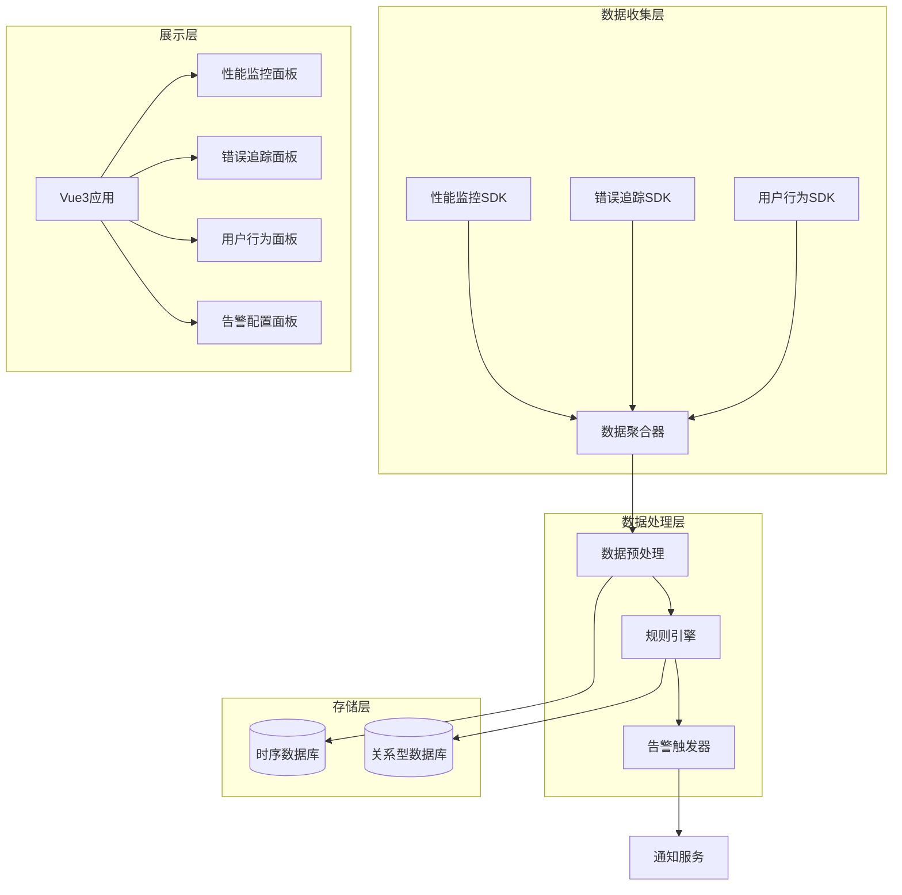
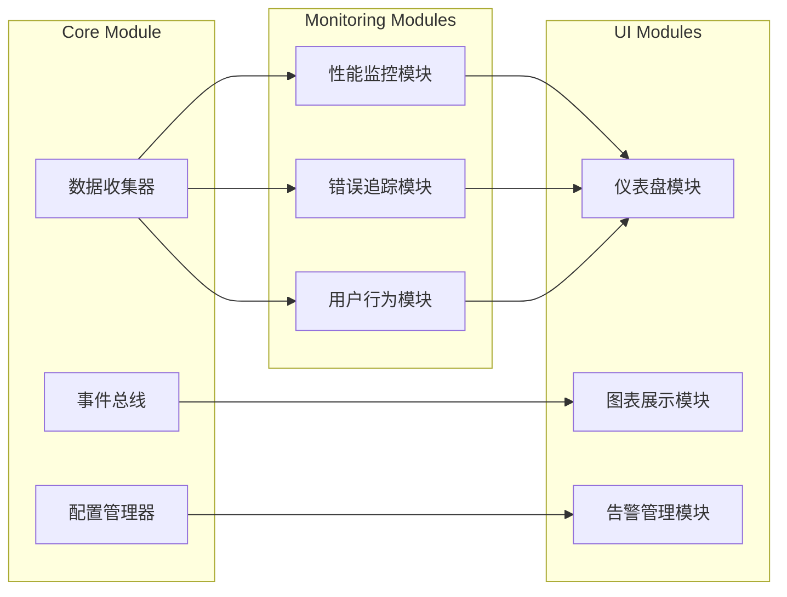
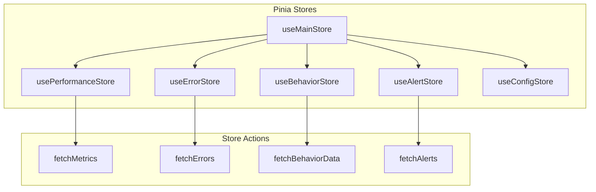

# 前端告警系统设计文档

## 1. 概述

### 1.1 项目背景
前端告警系统是一个用于监控前端应用运行状态的综合性平台，旨在实时捕获和分析应用性能问题、错误异常和用户行为数据。本系统将作为内部培训工具，帮助团队理解前端监控的重要性和实现方案。

### 1.2 核心目标
- 提供实时的应用性能监控能力
- 实现全面的错误追踪和分析
- 支持用户行为数据收集和分析
- 构建直观的数据可视化界面
- 提供告警规则配置和通知机制

### 1.3 技术栈
- **前端框架**: Vue 3 + TypeScript
- **构建工具**: Vite
- **状态管理**: Pinia
- **路由**: Vue Router 4
- **UI组件库**: Element Plus
- **图表库**: ECharts
- **HTTP客户端**: Axios
- **CSS预处理**: SCSS

## 2. 系统架构

### 2.1 整体架构图



### 2.2 模块架构



## 3. 组件架构

### 3.1 组件层次结构

```
AlertSystem/
├── layouts/
│   ├── DefaultLayout.vue          # 默认布局
│   └── components/
│       ├── AppHeader.vue          # 顶部导航
│       ├── AppSidebar.vue         # 侧边栏
│       └── AppFooter.vue          # 底部
├── views/
│   ├── Dashboard/                 # 仪表盘
│   │   ├── DashboardView.vue
│   │   └── components/
│   │       ├── MetricsOverview.vue
│   │       ├── AlertSummary.vue
│   │       └── QuickActions.vue
│   ├── Performance/               # 性能监控
│   │   ├── PerformanceView.vue
│   │   └── components/
│   │       ├── PageLoadMetrics.vue
│   │       ├── ResourceMetrics.vue
│   │       ├── UserTimingMetrics.vue
│   │       └── VitalSignsChart.vue
│   ├── ErrorTracking/             # 错误追踪
│   │   ├── ErrorTrackingView.vue
│   │   └── components/
│   │       ├── ErrorList.vue
│   │       ├── ErrorDetail.vue
│   │       ├── ErrorTrends.vue
│   │       └── StackTrace.vue
│   ├── UserBehavior/              # 用户行为
│   │   ├── UserBehaviorView.vue
│   │   └── components/
│   │       ├── ClickHeatmap.vue
│   │       ├── UserJourney.vue
│   │       ├── SessionReplay.vue
│   │       └── ConversionFunnel.vue
│   └── AlertConfig/               # 告警配置
│       ├── AlertConfigView.vue
│       └── components/
│           ├── RuleEditor.vue
│           ├── NotificationSettings.vue
│           └── ChannelConfig.vue
└── components/
    ├── common/
    │   ├── BaseChart.vue          # 基础图表组件
    │   ├── DataTable.vue          # 数据表格
    │   ├── FilterPanel.vue        # 过滤面板
    │   └── TimeRangePicker.vue    # 时间范围选择
    └── business/
        ├── MetricCard.vue         # 指标卡片
        ├── AlertBadge.vue         # 告警徽章
        └── TrendIndicator.vue     # 趋势指标
```

### 3.2 核心组件定义

#### 3.2.1 BaseChart 组件
```typescript
// components/common/BaseChart.vue
interface ChartProps {
  type: 'line' | 'bar' | 'pie' | 'scatter'
  data: ChartDataset[]
  options?: EChartsOption
  height?: string
  loading?: boolean
}

interface ChartDataset {
  name: string
  data: Array<[string | number, number]>
  color?: string
}
```

#### 3.2.2 MetricCard 组件
```typescript
// components/business/MetricCard.vue
interface MetricCardProps {
  title: string
  value: number | string
  unit?: string
  trend?: 'up' | 'down' | 'stable'
  trendValue?: number
  status?: 'normal' | 'warning' | 'error'
  icon?: string
}
```

#### 3.2.3 DataTable 组件
```typescript
// components/common/DataTable.vue
interface TableColumn {
  key: string
  title: string
  width?: string
  sortable?: boolean
  filterable?: boolean
  formatter?: (value: any, row: any) => string
}

interface TableProps {
  columns: TableColumn[]
  data: any[]
  loading?: boolean
  pagination?: boolean
  pageSize?: number
}
```

## 4. 路由架构

### 4.1 路由配置

```typescript
// router/index.ts
const routes = [
  {
    path: '/',
    component: DefaultLayout,
    children: [
      {
        path: '',
        name: 'Dashboard',
        component: () => import('@/views/Dashboard/DashboardView.vue')
      },
      {
        path: '/performance',
        name: 'Performance',
        component: () => import('@/views/Performance/PerformanceView.vue'),
        children: [
          {
            path: 'page-load',
            name: 'PageLoad',
            component: () => import('@/views/Performance/PageLoadView.vue')
          },
          {
            path: 'resource',
            name: 'Resource',
            component: () => import('@/views/Performance/ResourceView.vue')
          }
        ]
      },
      {
        path: '/errors',
        name: 'ErrorTracking',
        component: () => import('@/views/ErrorTracking/ErrorTrackingView.vue')
      },
      {
        path: '/behavior',
        name: 'UserBehavior',
        component: () => import('@/views/UserBehavior/UserBehaviorView.vue')
      },
      {
        path: '/alerts',
        name: 'AlertConfig',
        component: () => import('@/views/AlertConfig/AlertConfigView.vue')
      }
    ]
  }
]
```

## 5. 状态管理

### 5.1 Store 结构



### 5.2 Performance Store

```typescript
// stores/performance.ts
interface PerformanceMetrics {
  pageLoadTime: number
  firstContentfulPaint: number
  largestContentfulPaint: number
  firstInputDelay: number
  cumulativeLayoutShift: number
  resourceLoadTime: ResourceMetric[]
}

interface ResourceMetric {
  name: string
  type: string
  loadTime: number
  size: number
  timestamp: number
}

export const usePerformanceStore = defineStore('performance', {
  state: () => ({
    metrics: {} as PerformanceMetrics,
    historicalData: [] as PerformanceMetrics[],
    loading: false,
    timeRange: '24h'
  }),
  
  actions: {
    async fetchMetrics(timeRange: string) {
      this.loading = true
      try {
        const response = await api.get(`/performance/metrics`, {
          params: { timeRange }
        })
        this.metrics = response.data
      } finally {
        this.loading = false
      }
    }
  }
})
```

## 6. API集成层

### 6.1 API 服务架构

```typescript
// services/api.ts
class ApiService {
  private http = axios.create({
    baseURL: '/api',
    timeout: 10000
  })

  // 性能监控API
  performance = {
    getMetrics: (params: MetricsQuery) => 
      this.http.get<PerformanceMetrics>('/performance/metrics', { params }),
    getVitalSigns: (timeRange: string) =>
      this.http.get<VitalSigns>('/performance/vitals', { params: { timeRange } })
  }

  // 错误追踪API
  errors = {
    getErrors: (params: ErrorQuery) =>
      this.http.get<ErrorList>('/errors', { params }),
    getErrorDetail: (errorId: string) =>
      this.http.get<ErrorDetail>(`/errors/${errorId}`)
  }

  // 用户行为API
  behavior = {
    getEvents: (params: BehaviorQuery) =>
      this.http.get<BehaviorEvents>('/behavior/events', { params }),
    getHeatmap: (pageId: string) =>
      this.http.get<HeatmapData>(`/behavior/heatmap/${pageId}`)
  }
}
```

### 6.2 数据模型

```typescript
// types/api.ts
interface PerformanceMetrics {
  timestamp: number
  pageLoadTime: number
  fcp: number  // First Contentful Paint
  lcp: number  // Largest Contentful Paint
  fid: number  // First Input Delay
  cls: number  // Cumulative Layout Shift
  ttfb: number // Time to First Byte
}

interface ErrorData {
  id: string
  message: string
  stack: string
  fileName: string
  lineNumber: number
  columnNumber: number
  timestamp: number
  userAgent: string
  url: string
  userId?: string
  severity: 'low' | 'medium' | 'high' | 'critical'
}

interface BehaviorEvent {
  id: string
  type: 'click' | 'scroll' | 'hover' | 'focus' | 'page_view'
  element: string
  coordinates?: { x: number, y: number }
  timestamp: number
  sessionId: string
  userId?: string
  metadata: Record<string, any>
}
```

## 7. 监控功能详细设计

### 7.1 应用性能监控

#### 7.1.1 性能指标收集

**核心Web指标监控**
```typescript
// utils/performance/webVitals.ts
class WebVitalsCollector {
  private metrics: Map<string, number> = new Map()
  
  collectFCP() {
    // First Contentful Paint
    new PerformanceObserver((list) => {
      for (const entry of list.getEntries()) {
        if (entry.name === 'first-contentful-paint') {
          this.metrics.set('fcp', entry.startTime)
          this.reportMetric('fcp', entry.startTime)
        }
      }
    }).observe({ entryTypes: ['paint'] })
  }
  
  collectLCP() {
    // Largest Contentful Paint
    new PerformanceObserver((list) => {
      const entries = list.getEntries()
      const lastEntry = entries[entries.length - 1]
      this.metrics.set('lcp', lastEntry.startTime)
      this.reportMetric('lcp', lastEntry.startTime)
    }).observe({ entryTypes: ['largest-contentful-paint'] })
  }
  
  collectFID() {
    // First Input Delay
    new PerformanceObserver((list) => {
      for (const entry of list.getEntries()) {
        this.metrics.set('fid', entry.processingStart - entry.startTime)
        this.reportMetric('fid', entry.processingStart - entry.startTime)
      }
    }).observe({ entryTypes: ['first-input'] })
  }
  
  collectCLS() {
    // Cumulative Layout Shift
    let clsValue = 0
    new PerformanceObserver((list) => {
      for (const entry of list.getEntries()) {
        if (!entry.hadRecentInput) {
          clsValue += entry.value
        }
      }
      this.metrics.set('cls', clsValue)
      this.reportMetric('cls', clsValue)
    }).observe({ entryTypes: ['layout-shift'] })
  }
  
  private reportMetric(name: string, value: number) {
    // 发送数据到后端
    fetch('/api/performance/metrics', {
      method: 'POST',
      body: JSON.stringify({
        name,
        value,
        timestamp: Date.now(),
        url: window.location.href
      })
    })
  }
}
```

**资源加载监控**
```typescript
// utils/performance/resourceMonitor.ts
class ResourceMonitor {
  startMonitoring() {
    // 监控资源加载
    new PerformanceObserver((list) => {
      for (const entry of list.getEntries()) {
        this.analyzeResource(entry as PerformanceResourceTiming)
      }
    }).observe({ entryTypes: ['resource'] })
  }
  
  private analyzeResource(entry: PerformanceResourceTiming) {
    const resourceData = {
      name: entry.name,
      type: this.getResourceType(entry.name),
      loadTime: entry.responseEnd - entry.startTime,
      size: entry.transferSize,
      cache: entry.transferSize === 0 ? 'cached' : 'network',
      timestamp: Date.now()
    }
    
    // 检查是否超过阈值
    if (resourceData.loadTime > 1000) {
      this.reportSlowResource(resourceData)
    }
  }
  
  private getResourceType(url: string): string {
    if (url.match(/\.(js)$/)) return 'script'
    if (url.match(/\.(css)$/)) return 'stylesheet'
    if (url.match(/\.(png|jpg|jpeg|gif|svg)$/)) return 'image'
    if (url.match(/\.(woff|woff2|ttf)$/)) return 'font'
    return 'other'
  }
}
```

#### 7.1.2 性能监控界面

**性能指标卡片组件**
```vue
<!-- components/performance/VitalSignsCard.vue -->
<template>
  <div class="vital-signs-card">
    <div class="metric-item" v-for="metric in metrics" :key="metric.name">
      <div class="metric-header">
        <span class="metric-name">{{ metric.label }}</span>
        <el-tag :type="getStatusType(metric.value, metric.threshold)">
          {{ getStatusText(metric.value, metric.threshold) }}
        </el-tag>
      </div>
      <div class="metric-value">
        <span class="value">{{ formatValue(metric.value) }}</span>
        <span class="unit">{{ metric.unit }}</span>
      </div>
      <div class="metric-chart">
        <BaseChart 
          type="line" 
          :data="metric.historicalData" 
          :height="'60px'"
        />
      </div>
    </div>
  </div>
</template>

<script setup lang="ts">
interface MetricItem {
  name: string
  label: string
  value: number
  unit: string
  threshold: { good: number, needsImprovement: number }
  historicalData: ChartDataset[]
}

const metrics = ref<MetricItem[]>([
  {
    name: 'fcp',
    label: 'First Contentful Paint',
    value: 1200,
    unit: 'ms',
    threshold: { good: 1800, needsImprovement: 3000 },
    historicalData: []
  },
  {
    name: 'lcp',
    label: 'Largest Contentful Paint', 
    value: 2100,
    unit: 'ms',
    threshold: { good: 2500, needsImprovement: 4000 },
    historicalData: []
  }
])
</script>
```

### 7.2 错误追踪系统

#### 7.2.1 错误捕获机制

**全局错误处理器**
```typescript
// utils/errorTracking/errorHandler.ts
class ErrorTracker {
  private errorQueue: ErrorData[] = []
  private maxQueueSize = 50
  
  init() {
    this.setupGlobalErrorHandlers()
    this.setupPromiseRejectionHandler()
    this.setupVueErrorHandler()
  }
  
  private setupGlobalErrorHandlers() {
    window.addEventListener('error', (event) => {
      this.captureError({
        message: event.message,
        fileName: event.filename,
        lineNumber: event.lineno,
        columnNumber: event.colno,
        stack: event.error?.stack,
        type: 'javascript',
        timestamp: Date.now()
      })
    })
  }
  
  private setupPromiseRejectionHandler() {
    window.addEventListener('unhandledrejection', (event) => {
      this.captureError({
        message: `Unhandled Promise Rejection: ${event.reason}`,
        stack: event.reason?.stack,
        type: 'promise',
        timestamp: Date.now()
      })
    })
  }
  
  private setupVueErrorHandler() {
    const app = getCurrentInstance()?.appContext.app
    if (app) {
      app.config.errorHandler = (error, instance, info) => {
        this.captureError({
          message: error.message,
          stack: error.stack,
          component: instance?.$options.name || 'Unknown',
          errorInfo: info,
          type: 'vue',
          timestamp: Date.now()
        })
      }
    }
  }
  
  captureError(errorData: Partial<ErrorData>) {
    const enrichedError = this.enrichErrorData(errorData)
    this.errorQueue.push(enrichedError)
    
    if (this.errorQueue.length >= this.maxQueueSize) {
      this.flushErrors()
    }
  }
  
  private enrichErrorData(errorData: Partial<ErrorData>): ErrorData {
    return {
      id: this.generateErrorId(),
      message: errorData.message || 'Unknown error',
      stack: errorData.stack || '',
      fileName: errorData.fileName || '',
      lineNumber: errorData.lineNumber || 0,
      columnNumber: errorData.columnNumber || 0,
      timestamp: errorData.timestamp || Date.now(),
      userAgent: navigator.userAgent,
      url: window.location.href,
      userId: this.getCurrentUserId(),
      severity: this.calculateSeverity(errorData),
      ...errorData
    }
  }
}
```

**错误分类和聚合**
```typescript
// utils/errorTracking/errorAggregator.ts
class ErrorAggregator {
  groupErrorsByPattern(errors: ErrorData[]): ErrorGroup[] {
    const groups = new Map<string, ErrorData[]>()
    
    errors.forEach(error => {
      const pattern = this.extractErrorPattern(error)
      if (!groups.has(pattern)) {
        groups.set(pattern, [])
      }
      groups.get(pattern)!.push(error)
    })
    
    return Array.from(groups.entries()).map(([pattern, errors]) => ({
      pattern,
      count: errors.length,
      firstSeen: Math.min(...errors.map(e => e.timestamp)),
      lastSeen: Math.max(...errors.map(e => e.timestamp)),
      severity: this.calculateGroupSeverity(errors),
      errors
    }))
  }
  
  private extractErrorPattern(error: ErrorData): string {
    // 提取错误模式，用于分组
    const stackLines = error.stack.split('\n')
    const relevantLine = stackLines.find(line => 
      !line.includes('node_modules') && 
      line.includes('.vue') || line.includes('.ts')
    )
    
    return `${error.message}:${relevantLine || 'unknown'}`
  }
}
```

#### 7.2.2 错误追踪界面

**错误列表组件**
```vue
<!-- components/errorTracking/ErrorList.vue -->
<template>
  <div class="error-list">
    <div class="error-filters">
      <FilterPanel 
        :filters="filters"
        @filter-change="handleFilterChange"
      />
    </div>
    
    <DataTable
      :columns="columns"
      :data="filteredErrors"
      :loading="loading"
      @row-click="showErrorDetail"
    >
      <template #severity="{ row }">
        <el-tag :type="getSeverityType(row.severity)">
          {{ row.severity.toUpperCase() }}
        </el-tag>
      </template>
      
      <template #count="{ row }">
        <el-badge :value="row.count" class="error-count">
          <span>{{ row.count }}</span>
        </el-badge>
      </template>
    </DataTable>
    
    <ErrorDetailDialog 
      v-model:visible="detailVisible"
      :error="selectedError"
    />
  </div>
</template>

<script setup lang="ts">
interface ErrorGroup {
  id: string
  pattern: string
  message: string
  count: number
  severity: string
  firstSeen: number
  lastSeen: number
  affected_users: number
}

const columns = [
  { key: 'message', title: '错误信息', width: '40%' },
  { key: 'severity', title: '严重程度', width: '10%' },
  { key: 'count', title: '发生次数', width: '10%' },
  { key: 'affected_users', title: '影响用户', width: '10%' },
  { key: 'lastSeen', title: '最后发生', width: '15%', formatter: formatTime },
  { key: 'firstSeen', title: '首次发生', width: '15%', formatter: formatTime }
]

const filters = [
  {
    key: 'severity',
    label: '严重程度',
    type: 'select',
    options: [
      { label: '全部', value: '' },
      { label: '低', value: 'low' },
      { label: '中', value: 'medium' },
      { label: '高', value: 'high' },
      { label: '严重', value: 'critical' }
    ]
  },
  {
    key: 'timeRange',
    label: '时间范围',
    type: 'timerange'
  }
]
</script>
```

### 7.3 用户行为分析

#### 7.3.1 行为数据收集

**点击事件追踪**
```typescript
// utils/behavior/clickTracker.ts
class ClickTracker {
  private events: BehaviorEvent[] = []
  
  init() {
    document.addEventListener('click', this.handleClick.bind(this), true)
  }
  
  private handleClick(event: MouseEvent) {
    const target = event.target as HTMLElement
    const elementInfo = this.getElementInfo(target)
    
    const clickEvent: BehaviorEvent = {
      id: this.generateEventId(),
      type: 'click',
      element: elementInfo.selector,
      coordinates: { x: event.clientX, y: event.clientY },
      timestamp: Date.now(),
      sessionId: this.getSessionId(),
      userId: this.getUserId(),
      metadata: {
        elementText: elementInfo.text,
        elementType: elementInfo.type,
        pageUrl: window.location.href,
        viewportSize: {
          width: window.innerWidth,
          height: window.innerHeight
        }
      }
    }
    
    this.recordEvent(clickEvent)
  }
  
  private getElementInfo(element: HTMLElement) {
    return {
      selector: this.generateSelector(element),
      text: element.textContent?.trim() || '',
      type: element.tagName.toLowerCase(),
      className: element.className
    }
  }
  
  private generateSelector(element: HTMLElement): string {
    if (element.id) {
      return `#${element.id}`
    }
    
    let selector = element.tagName.toLowerCase()
    if (element.className) {
      selector += `.${element.className.split(' ').join('.')}`
    }
    
    // 添加父级选择器以确保唯一性
    let parent = element.parentElement
    let path = [selector]
    
    while (parent && path.length < 5) {
      let parentSelector = parent.tagName.toLowerCase()
      if (parent.id) {
        path.unshift(`#${parent.id}`)
        break
      }
      if (parent.className) {
        parentSelector += `.${parent.className.split(' ')[0]}`
      }
      path.unshift(parentSelector)
      parent = parent.parentElement
    }
    
    return path.join(' > ')
  }
}
```

**页面停留时间追踪**
```typescript
// utils/behavior/pageTimer.ts
class PageTimer {
  private startTime: number = 0
  private isActive: boolean = true
  private totalActiveTime: number = 0
  
  init() {
    this.startTime = Date.now()
    this.setupVisibilityListeners()
    this.setupBeforeUnloadListener()
  }
  
  private setupVisibilityListeners() {
    document.addEventListener('visibilitychange', () => {
      if (document.hidden) {
        this.pauseTimer()
      } else {
        this.resumeTimer()
      }
    })
  }
  
  private pauseTimer() {
    if (this.isActive) {
      this.totalActiveTime += Date.now() - this.startTime
      this.isActive = false
    }
  }
  
  private resumeTimer() {
    if (!this.isActive) {
      this.startTime = Date.now()
      this.isActive = true
    }
  }
  
  private setupBeforeUnloadListener() {
    window.addEventListener('beforeunload', () => {
      if (this.isActive) {
        this.totalActiveTime += Date.now() - this.startTime
      }
      
      this.reportPageTime({
        url: window.location.href,
        activeTime: this.totalActiveTime,
        totalTime: Date.now() - this.startTime,
        timestamp: Date.now()
      })
    })
  }
}
```

#### 7.3.2 热力图组件

```vue
<!-- components/behavior/ClickHeatmap.vue -->
<template>
  <div class="heatmap-container">
    <div class="heatmap-controls">
      <el-select v-model="selectedPage" @change="loadHeatmapData">
        <el-option 
          v-for="page in pages" 
          :key="page.url" 
          :label="page.title" 
          :value="page.url"
        />
      </el-select>
      
      <TimeRangePicker 
        v-model="timeRange" 
        @change="loadHeatmapData"
      />
    </div>
    
    <div class="heatmap-canvas" ref="heatmapRef">
      <canvas 
        ref="canvasRef" 
        :width="canvasWidth" 
        :height="canvasHeight"
        @mousemove="showTooltip"
      />
      
      <div 
        v-if="tooltip.visible" 
        class="heatmap-tooltip"
        :style="{ left: tooltip.x + 'px', top: tooltip.y + 'px' }"
      >
        <div>点击次数: {{ tooltip.count }}</div>
        <div>元素: {{ tooltip.element }}</div>
      </div>
    </div>
  </div>
</template>

<script setup lang="ts">
interface HeatmapPoint {
  x: number
  y: number
  count: number
  element: string
}

class HeatmapRenderer {
  private canvas: HTMLCanvasElement
  private ctx: CanvasRenderingContext2D
  
  constructor(canvas: HTMLCanvasElement) {
    this.canvas = canvas
    this.ctx = canvas.getContext('2d')!
  }
  
  render(points: HeatmapPoint[]) {
    this.ctx.clearRect(0, 0, this.canvas.width, this.canvas.height)
    
    // 创建热力图渐变
    const maxCount = Math.max(...points.map(p => p.count))
    
    points.forEach(point => {
      const intensity = point.count / maxCount
      const radius = Math.max(20, intensity * 50)
      
      const gradient = this.ctx.createRadialGradient(
        point.x, point.y, 0,
        point.x, point.y, radius
      )
      
      const alpha = intensity * 0.6
      gradient.addColorStop(0, `rgba(255, 0, 0, ${alpha})`)
      gradient.addColorStop(0.5, `rgba(255, 255, 0, ${alpha * 0.5})`)
      gradient.addColorStop(1, 'rgba(255, 255, 0, 0)')
      
      this.ctx.fillStyle = gradient
      this.ctx.fillRect(
        point.x - radius, 
        point.y - radius, 
        radius * 2, 
        radius * 2
      )
    })
  }
}
</script>
```
```