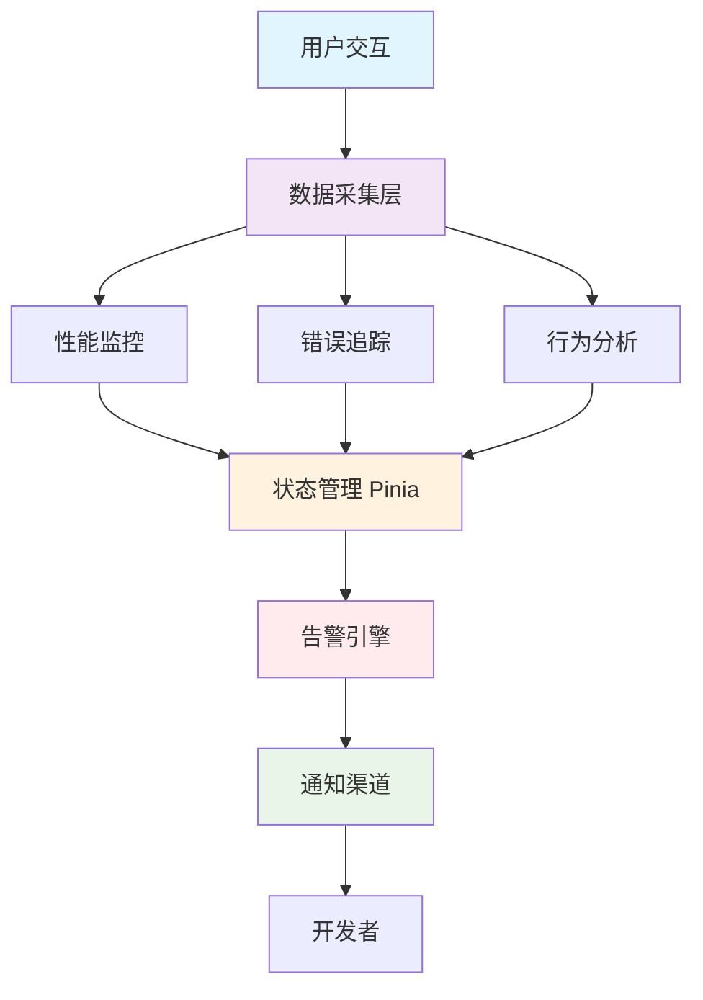

# 前端告警系统培训文档

## 📚 目录

1. [什么是前端告警](#什么是前端告警)
2. [为什么需要前端告警](#为什么需要前端告警)
3. [系统架构概览](#系统架构概览)
4. [页面功能详解](#页面功能详解)
5. [核心功能实现](#核心功能实现)
6. [如何实现前端告警](#如何实现前端告警)
7. [最佳实践](#最佳实践)

---

## 🎯 什么是前端告警

前端告警是一种主动监控机制，用于实时检测前端应用的性能问题、错误异常和用户行为异常，并在发现问题时及时通知开发团队。它是现代前端应用质量保障体系的重要组成部分。

### 核心组成
- **性能监控**: 监控Web Vitals等关键性能指标
- **错误追踪**: 捕获JavaScript错误、网络错误等异常
- **用户行为分析**: 分析用户交互模式，发现体验问题
- **告警通知**: 当指标异常时主动通知相关人员

---

## 🔑 为什么需要前端告警

### 传统痛点
- 用户遇到问题后才被动发现
- 性能问题难以量化和定位
- 错误信息分散，难以统一管理
- 缺乏数据驱动的决策依据

### 价值收益
- **提前发现问题**: 在用户抱怨前主动发现并解决问题
- **提升用户体验**: 通过数据分析持续优化用户体验
- **降低维护成本**: 快速定位问题根源，缩短修复时间
- **数据驱动优化**: 基于真实数据进行产品决策

---

## 🏗️ 系统架构概览



### 技术栈
- **框架**: Vue 3 + TypeScript + Vite
- **状态管理**: Pinia
- **性能监控**: Web Vitals API
- **UI组件**: Element Plus
- **图表可视化**: ECharts

---

## 📱 页面功能详解

### 1. 控制台总览 (Dashboard)

**路径**: `/dashboard`  
**核心职责**: 系统监控数据的统一展示和快速概览

#### 功能模块

**状态卡片区域**
- 性能评分：基于Web Vitals计算的综合评分
- 错误数量：实时错误统计，按严重程度分类
- 活跃用户：当前会话数和用户活跃度
- 告警规则：活跃告警规则数量统计

**实时图表区域**
- 性能指标趋势图：展示FCP、LCP、FID、CLS、TTFB变化
- 错误统计图表：错误类型分布和时间趋势
- 支持时间周期切换（1小时/6小时/24小时/7天）

**详细信息面板**
- 最新错误列表：显示最近5条错误记录
- 用户行为摘要：热门交互元素和会话统计
- 告警活动：未读告警数量和最新告警

**快速演示功能**
```javascript
// 性能演示 - 模拟慢任务
const triggerPerformanceDemo = async () => {
  await simulateSlowTask(800)      // 模拟CPU密集任务
  simulateNetworkDelay()           // 模拟网络延迟
  simulateLayoutShift()            // 模拟布局偏移
}
```

#### 教学重点
- **数据聚合展示**: 如何将分散的监控数据整合为直观的仪表盘
- **实时数据更新**: 基于响应式数据的实时界面更新机制
- **快速问题定位**: 通过视觉化方式快速识别系统问题

---

### 2. 性能监控 (PerformanceView)

**路径**: `/performance`  
**核心职责**: 深度监控和分析前端性能指标

#### Web Vitals 监控

**FCP (First Contentful Paint) - 首次内容绘制**
```typescript
getFCP((metric) => {
  recordMetric('fcp', metric.value)
  // 阈值判断：≤1.8s优秀，≤3s需要改进，>3s差
})
```

**LCP (Largest Contentful Paint) - 最大内容绘制**
```typescript
getLCP((metric) => {
  recordMetric('lcp', metric.value)
  // 阈值判断：≤2.5s优秀，≤4s需要改进，>4s差
})
```

**FID (First Input Delay) - 首次输入延迟**
```typescript
getFID((metric) => {
  recordMetric('fid', metric.value)
  // 阈值判断：≤100ms优秀，≤300ms需要改进，>300ms差
})
```

**CLS (Cumulative Layout Shift) - 累积布局偏移**
```typescript
getCLS((metric) => {
  recordMetric('cls', metric.value)
  // 阈值判断：≤0.1优秀，≤0.25需要改进，>0.25差
})
```

#### 性能分析功能
- **性能评分算法**: 基于Web Vitals的综合评分计算
- **资源时序分析**: DNS、TCP、请求、响应各阶段耗时
- **自定义性能测量**: 支持业务关键路径的性能监控

#### 演示功能
- 慢任务模拟：模拟CPU密集型操作对FID的影响
- 网络延迟模拟：模拟网络请求对TTFB的影响
- 布局偏移模拟：模拟动态内容对CLS的影响

#### 教学重点
- **性能指标含义**: 每个Web Vitals指标的业务意义
- **阈值设定策略**: 如何根据业务场景设定合理阈值
- **性能优化方向**: 基于监控数据指导性能优化工作

---

### 3. 错误追踪 (ErrorTrackingView)

**路径**: `/errors`  
**核心职责**: 全面捕获和分析前端错误

#### 错误类型覆盖

**JavaScript运行时错误**
```typescript
window.addEventListener('error', (event) => {
  const error: ErrorEvent = {
    type: 'javascript',
    message: event.message,
    stack: event.error?.stack,
    filename: event.filename,
    lineno: event.lineno,
    colno: event.colno,
    severity: determineSeverity(event.message)
  }
  errorStore.addError(error)
})
```

**Promise拒绝错误**
```typescript
window.addEventListener('unhandledrejection', (event) => {
  const error: ErrorEvent = {
    type: 'promise',
    message: `未处理的Promise拒绝: ${event.reason}`,
    severity: 'high'
  }
  errorStore.addError(error)
})
```

**网络请求错误**
```typescript
// Fetch API拦截
const originalFetch = window.fetch
window.fetch = async (...args) => {
  try {
    const response = await originalFetch(...args)
    if (!response.ok) {
      recordNetworkError(response.status, args[0])
    }
    return response
  } catch (error) {
    recordNetworkError(0, args[0], error)
    throw error
  }
}
```

#### 错误分析功能
- **错误聚合**: 相同错误的归类和计数统计
- **错误趋势**: 错误发生频率的时间趋势分析
- **影响面评估**: 分析错误影响的用户数和页面数
- **严重程度评级**: 基于关键词的智能严重程度判断

#### 过滤和搜索
- 按错误类型过滤：JavaScript/网络/资源/Promise
- 按严重程度过滤：严重/高/中/低
- 关键词搜索：在错误消息中搜索特定关键词
- 时间范围筛选：指定时间段内的错误记录

#### 教学重点
- **错误捕获策略**: 如何设计全面的错误捕获机制
- **错误分类方法**: 如何对错误进行有效分类和优先级排序
- **错误上报机制**: 如何设计高效的错误上报系统

---

### 4. 用户行为分析 (UserBehaviorView)

**路径**: `/behavior`  
**核心职责**: 分析用户在应用中的交互行为模式

#### 行为追踪维度

**点击行为追踪**
```typescript
document.addEventListener('click', (event) => {
  const target = event.target as HTMLElement
  const elementInfo = getElementInfo(target)
  const coordinates = { x: event.clientX, y: event.clientY }
  
  behaviorStore.trackClick(
    elementInfo.text,
    coordinates,
    elementInfo.selector
  )
})
```

**滚动行为追踪**
```typescript
const scrollHandler = debounce(() => {
  const scrollPercent = Math.round(
    (window.scrollY / (document.documentElement.scrollHeight - window.innerHeight)) * 100
  )
  behaviorStore.trackEvent({
    type: 'scroll',
    value: JSON.stringify({ scrollY: window.scrollY, percent: scrollPercent })
  })
}, 200)
```

**输入行为追踪（隐私保护）**
```typescript
const sanitizeInputValue = (input: HTMLInputElement): string => {
  const sensitiveTypes = ['password', 'email', 'tel']
  if (sensitiveTypes.includes(input.type)) {
    return `[${input.type}:${input.value.length}字符]`
  }
  return input.value.substring(0, 50)
}
```

#### 分析功能
- **会话分析**: 用户会话时长和页面浏览路径
- **热力图生成**: 基于点击数据生成页面热力图
- **交互元素统计**: 最受欢迎的交互元素排行
- **用户路径分析**: 用户在应用中的导航流向

#### 隐私保护措施
- **敏感信息脱敏**: 密码、邮箱等敏感输入不记录明文
- **数据最小化**: 只收集必要的行为数据
- **用户同意机制**: 提供行为追踪的开关控制

#### 教学重点
- **行为数据价值**: 如何通过行为数据洞察用户需求
- **隐私合规**: 在数据收集和用户隐私间找到平衡
- **数据分析方法**: 如何从行为数据中提取有价值的见解

---

### 5. 告警配置 (SettingsView)

**路径**: `/settings`  
**核心职责**: 配置告警规则、通知方式和系统参数

#### 告警规则管理

**规则定义结构**
```typescript
interface AlertRule {
  id: string
  name: string                    // 规则名称
  type: 'performance' | 'error' | 'behavior'  // 规则类型
  condition: string               // 触发条件表达式
  threshold: number               // 阈值
  severity: 'low' | 'medium' | 'high' | 'critical'  // 严重程度
  enabled: boolean                // 启用状态
}
```

**预设规则示例**
- 性能规则：`FCP > 3000ms` - 首次内容绘制时间过长
- 错误规则：`error_rate > 10/hour` - 错误率超过每小时10次
- 行为规则：`session_duration < 30s` - 用户会话时长过短

#### 通知配置

**多渠道通知支持**
- **浏览器通知**: 利用Notification API推送桌面通知
- **控制台输出**: 在开发者控制台输出告警信息
- **Webhook集成**: 支持向第三方系统发送告警数据

**静默时间设置**
```typescript
interface SilentHours {
  start: string    // 开始时间 "22:00"
  end: string      // 结束时间 "08:00"
}

// 静默时间判断逻辑
const isInSilentHours = (config: SilentHours): boolean => {
  const now = new Date()
  const currentHour = now.getHours()
  const currentMinute = now.getMinutes()
  const currentTime = currentHour * 60 + currentMinute
  
  // 处理跨日情况
  const startTime = parseTime(config.start)
  const endTime = parseTime(config.end)
  
  if (startTime < endTime) {
    return currentTime >= startTime && currentTime <= endTime
  } else {
    return currentTime >= startTime || currentTime <= endTime
  }
}
```

#### 阈值配置策略

**性能阈值设置**
- FCP阈值：1800ms（参考Google推荐标准）
- LCP阈值：2500ms（用户体验良好标准）
- FID阈值：100ms（交互响应性标准）
- CLS阈值：0.1（视觉稳定性标准）

**错误限制设置**
- 最大错误数：1000条（避免内存溢出）
- 错误率阈值：可按时间维度设定（小时/天）

#### 教学重点
- **规则设计原则**: 如何设计有效且不过度打扰的告警规则
- **阈值调优策略**: 基于业务特点和用户体验标准设定阈值
- **通知渠道选择**: 不同场景下选择合适的通知方式

---

## 🔧 核心功能实现

### 1. 性能监控实现原理

#### Web Vitals集成
```typescript
import { getCLS, getFID, getFCP, getLCP, getTTFB } from 'web-vitals'

export function usePerformanceMonitoring() {
  const initWebVitals = () => {
    // 首次内容绘制
    getFCP((metric) => {
      recordMetric('fcp', metric.value)
    })
    
    // 最大内容绘制  
    getLCP((metric) => {
      recordMetric('lcp', metric.value)
    })
    
    // 首次输入延迟
    getFID((metric) => {
      recordMetric('fid', metric.value)
    })
    
    // 累积布局偏移
    getCLS((metric) => {
      recordMetric('cls', metric.value)
    })
    
    // 首字节时间
    getTTFB((metric) => {
      recordMetric('ttfb', metric.value)
    })
  }
}
```

#### 性能评分算法
```typescript
const calculatePerformanceScore = (metrics: PerformanceMetrics): number => {
  const weights = { fcp: 0.2, lcp: 0.25, fid: 0.25, cls: 0.25, ttfb: 0.05 }
  const thresholds = { fcp: 1800, lcp: 2500, fid: 100, cls: 0.1, ttfb: 800 }
  
  let score = 0
  Object.entries(weights).forEach(([metric, weight]) => {
    const value = metrics[metric as keyof PerformanceMetrics]
    const threshold = thresholds[metric as keyof typeof thresholds]
    const metricScore = Math.max(0, 100 - (value / threshold) * 50)
    score += metricScore * weight
  })
  
  return Math.round(Math.max(0, Math.min(100, score)))
}
```

### 2. 错误追踪实现原理

#### 全局错误捕获
```typescript
export function useErrorTracking() {
  const startErrorTracking = () => {
    // JavaScript错误
    window.addEventListener('error', handleJavaScriptError)
    
    // Promise拒绝
    window.addEventListener('unhandledrejection', handlePromiseRejection)
    
    // 资源加载错误（事件捕获阶段）
    window.addEventListener('error', handleResourceError, true)
    
    // 网络请求拦截
    interceptFetch()
    interceptXHR()
  }
}
```

#### 错误严重程度判断
```typescript
const determineSeverity = (message: string): ErrorEvent['severity'] => {
  const criticalKeywords = ['cannot read', 'undefined is not', 'null is not']
  const highKeywords = ['syntax error', 'type error', 'range error']
  
  const lowerMessage = message.toLowerCase()
  
  if (criticalKeywords.some(keyword => lowerMessage.includes(keyword))) {
    return 'critical'
  }
  if (highKeywords.some(keyword => lowerMessage.includes(keyword))) {
    return 'high'
  }
  return 'medium'
}
```

### 3. 用户行为追踪实现

#### 事件监听策略
```typescript
export function useBehaviorTracking() {
  const setupEventListeners = () => {
    // 点击事件（立即记录）
    document.addEventListener('click', handleClick)
    
    // 滚动事件（防抖处理）
    document.addEventListener('scroll', debounce(handleScroll, 200))
    
    // 输入事件（防抖 + 脱敏）
    document.addEventListener('input', debounce(handleInput, 500))
    
    // 页面可见性变化
    document.addEventListener('visibilitychange', handleVisibilityChange)
  }
}
```

#### 隐私保护机制
```typescript
const sanitizeInputValue = (input: HTMLInputElement): string => {
  const sensitiveTypes = ['password', 'email', 'tel', 'credit-card']
  const sensitiveNames = ['password', 'pwd', 'email', 'phone']
  
  const isSensitive = sensitiveTypes.includes(input.type) || 
    sensitiveNames.some(name => input.name?.toLowerCase().includes(name))
  
  if (isSensitive) {
    return `[${input.type}:${input.value.length}字符]`
  }
  
  return input.value.substring(0, 50)  // 限制长度
}
```

### 4. 告警系统实现

#### 规则引擎
```typescript
class AlertEngine {
  evaluateRule(rule: AlertRule, currentData: any): boolean {
    try {
      // 解析条件表达式
      const condition = rule.condition
      const threshold = rule.threshold
      
      // 根据规则类型获取对应数据
      const value = this.extractValue(rule.type, condition, currentData)
      
      // 执行条件判断
      return this.evaluateCondition(condition, value, threshold)
    } catch (error) {
      console.warn('告警规则评估失败:', error)
      return false
    }
  }
  
  private evaluateCondition(condition: string, value: number, threshold: number): boolean {
    if (condition.includes('>')) return value > threshold
    if (condition.includes('<')) return value < threshold
    if (condition.includes('>=')) return value >= threshold
    if (condition.includes('<=')) return value <= threshold
    if (condition.includes('==')) return value === threshold
    return false
  }
}
```

#### 通知分发机制
```typescript
const sendNotification = (notification: Notification) => {
  const { config } = alertStore
  
  // 检查静默时间
  if (isInSilentHours(config.silentHours)) {
    console.log('当前为静默时间，跳过通知')
    return
  }
  
  // 多渠道分发
  config.notificationMethods.forEach(method => {
    switch (method) {
      case 'browser':
        sendBrowserNotification(notification)
        break
      case 'console':
        sendConsoleNotification(notification)
        break
      case 'webhook':
        sendWebhookNotification(notification, config.webhookUrl)
        break
    }
  })
}
```

---

## 🚀 如何实现前端告警

### 第一步：选择监控指标

**性能指标优先级**
1. **必选指标**: FCP、LCP、FID、CLS（影响用户体验）
2. **重要指标**: TTFB、资源加载时间（影响页面性能）
3. **业务指标**: 关键操作耗时、转化漏斗指标

**错误指标优先级**  
1. **必选指标**: JavaScript错误率、网络错误率
2. **重要指标**: 资源加载失败率、Promise拒绝率
3. **业务指标**: 关键功能异常率、用户操作失败率

### 第二步：设计数据采集

**采集原则**
- **最小侵入**: 监控代码不应影响正常业务逻辑
- **性能友好**: 数据采集本身不能成为性能瓶颈
- **准确可靠**: 确保采集数据的准确性和完整性

**实现方案**
```typescript
// 1. 性能数据采集
import { getCLS, getFID, getFCP, getLCP } from 'web-vitals'

// 2. 错误数据采集
window.addEventListener('error', errorHandler)
window.addEventListener('unhandledrejection', promiseErrorHandler)

// 3. 用户行为数据采集
document.addEventListener('click', clickHandler)
document.addEventListener('scroll', debounce(scrollHandler, 200))
```

### 第三步：建立状态管理

**使用Pinia进行状态管理**
```typescript
// stores/performance.ts
export const usePerformanceStore = defineStore('performance', () => {
  const metrics = ref<PerformanceMetrics[]>([])
  const currentMetrics = ref<PerformanceMetrics | null>(null)
  const performanceScore = computed(() => calculateScore(currentMetrics.value))
  
  const addMetrics = (newMetrics: PerformanceMetrics) => {
    metrics.value.push(newMetrics)
    currentMetrics.value = newMetrics
  }
  
  return { metrics, currentMetrics, performanceScore, addMetrics }
})
```

### 第四步：配置告警规则

**规则设计模式**
```typescript
// 基于阈值的简单规则
{
  name: 'FCP性能告警',
  condition: 'fcp > 3000',
  threshold: 3000,
  severity: 'high'
}

// 基于趋势的复杂规则  
{
  name: '错误率增长告警',
  condition: 'error_rate_increase > 50%',
  threshold: 50,
  severity: 'critical'
}
```

### 第五步：实现通知机制

**多渠道通知支持**
```typescript
// 浏览器通知
const sendBrowserNotification = (message: string) => {
  if ('Notification' in window && Notification.permission === 'granted') {
    new Notification('前端告警', { body: message, icon: '/icon.png' })
  }
}

// Webhook通知
const sendWebhookNotification = async (data: any, url: string) => {
  try {
    await fetch(url, {
      method: 'POST',
      headers: { 'Content-Type': 'application/json' },
      body: JSON.stringify(data)
    })
  } catch (error) {
    console.error('Webhook通知发送失败:', error)
  }
}
```

### 第六步：数据可视化

**图表展示策略**
- **实时数据**: 使用ECharts实现实时更新的趋势图
- **统计数据**: 卡片形式展示关键指标摘要
- **详细分析**: 表格形式展示详细的错误日志和事件记录

---

## 💡 最佳实践

### 1. 监控策略设计

**分层监控原则**
- **基础监控**: 覆盖所有页面的通用指标
- **业务监控**: 针对关键业务流程的专项指标  
- **用户监控**: 基于用户群体的差异化监控

**告警规则设置**
- **避免告警疲劳**: 合理设置告警阈值，避免过度告警
- **分级响应**: 不同严重程度的问题采用不同的响应策略
- **动态调整**: 基于历史数据和业务变化动态调整规则

### 2. 性能优化建议

**监控代码优化**
- 使用Web Workers处理复杂计算
- 批量上报数据，减少网络请求频次
- 使用采样率避免100%的数据收集

**数据存储策略**
- 客户端使用IndexedDB存储离线数据
- 服务端使用时序数据库存储监控数据
- 定期清理过期数据，控制存储容量

### 3. 隐私和合规

**数据收集原则**
- **最小化原则**: 只收集必要的数据
- **透明原则**: 明确告知用户数据收集目的
- **控制原则**: 提供用户控制数据收集的选项

**敏感信息处理**
- 密码、邮箱等敏感字段进行脱敏处理
- 不收集个人身份信息（PII）
- 遵守GDPR、CCPA等隐私法规要求

### 4. 团队协作

**告警响应流程**
1. **告警接收**: 通过多渠道及时接收告警通知
2. **问题确认**: 快速确认告警的真实性和严重程度
3. **影响评估**: 评估问题对用户和业务的影响范围
4. **修复执行**: 执行相应的修复措施
5. **验证关闭**: 验证问题解决效果并关闭告警

**文档和培训**
- 建立告警处理手册和问题排查指南
- 定期进行告警系统使用培训
- 建立问题知识库，积累解决经验

---

## 🎓 总结

前端告警系统是现代Web应用质量保障的重要工具。通过本培训文档的学习，您应该掌握：

1. **理论基础**: 理解前端告警的价值和基本原理
2. **技术实现**: 掌握性能监控、错误追踪、行为分析的具体实现方法
3. **系统设计**: 学会设计完整的前端告警系统架构
4. **最佳实践**: 了解在实际项目中如何应用和优化告警系统

**下一步行动建议**：
- 在自己的项目中逐步引入监控功能
- 根据业务特点定制告警规则
- 持续优化和调整监控策略
- 建立团队的告警响应机制

记住：**好的前端告警系统不是为了增加工作量，而是为了让我们更早发现问题、更快解决问题，最终提升用户体验和开发效率。**